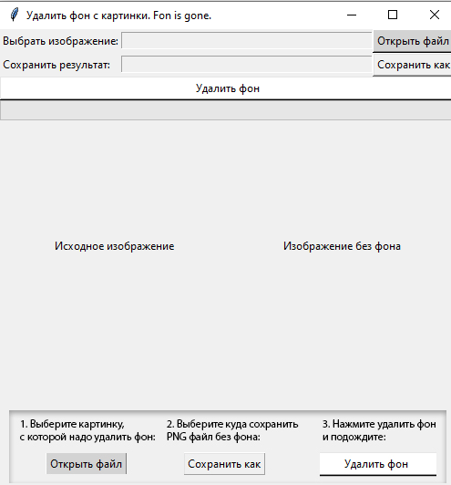
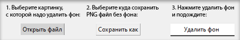

# Удалить фон с картинки. Fon is gone.
<hr>
В этом репозитории приложение на Python демонстрирующее возможности использования библиотеки `rembg` **для удаления фона с картинок**. Приложение оснащено графическим интерфейсом с использованием `tkinter`, для полноценной визуализации процесса. Для запуска обработки изображения в отдельном потоке используется модуль `threading`.



## Установка

До запуска скрипта вам необходимо установить используемые библиотеки. Установите необходимые, используя следующие команды:

```bash
    pip install rembg
    pip install tkinter
    pip install pillow
```

> rembg требует раннюю версию Python, например 3.10

## Использование



1. Запустите скрипт, используя следующую команду:

   ```bash
   python main.py

2. В интерфейсе приложения выберите изображение, с которого нужно удалить фон.
3. Выберите путь для сохранения результата.
4. нажмите "Удалить фон".

## Примеры изображений

В папке [examples](examples) вы найдете несколько изображений для тестирования приложения.
Выполните процесс удаления фона, используя эти изображения, чтобы оценить результаты.


## Лицензия

Этот проект распространяется под лицензией MIT. Подробности смотрите в файле [LICENSE](LICENSE).

## О библиотеке 'rembg'
The '[rembg](https://github.com/danielgatis/rembg)' library is a powerful tool designed for removing image backgrounds quickly and accurately. It utilizes deep learning techniques to achieve high-quality background removal without the need for complex manual adjustments. 'rembg' works particularly well for images with well-defined foreground objects and clear color contrasts between the object and the background.

## Поэма

Fon is gone, just an empty space now,\
A void left behind, a farewell bow.\
The pixels mourn in silent grace,\
As memories linger in that vacant place.

The screen echoes with whispers of the past,\
Images fade, but emotions last.\
In the realm of bytes and digital flow,\
A cyber ghost of Fon, a faint afterglow.

Yet, in the vastness of the virtual sea,\
Fons presence still ripples, wild and free.\
An absence felt in the binary air,\
A poetic pause, a moment to bear.